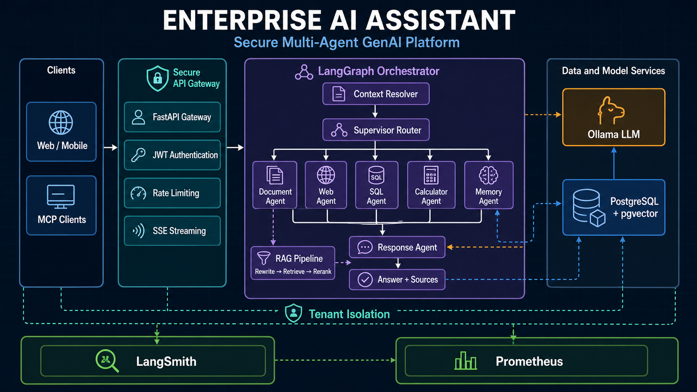
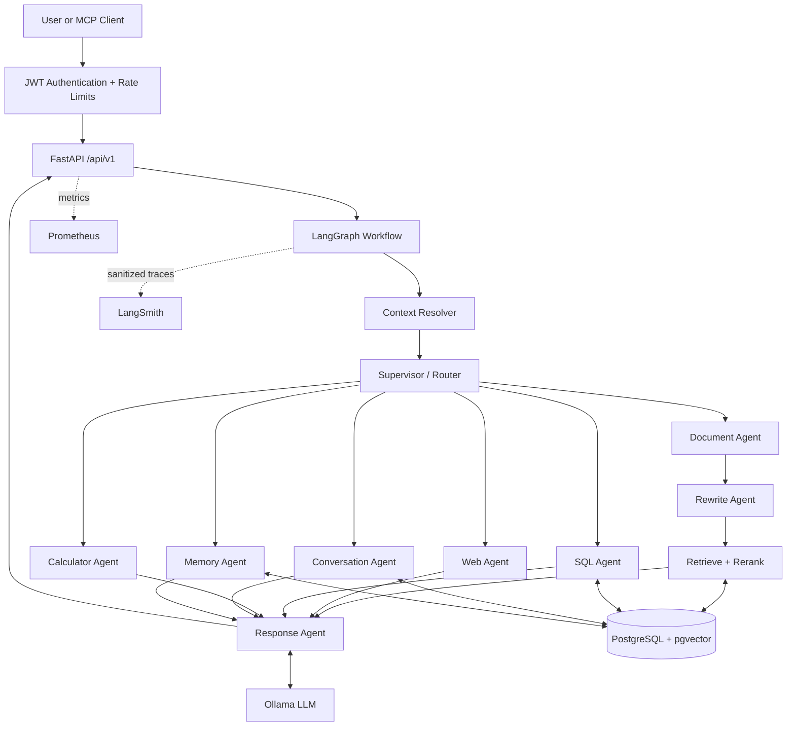
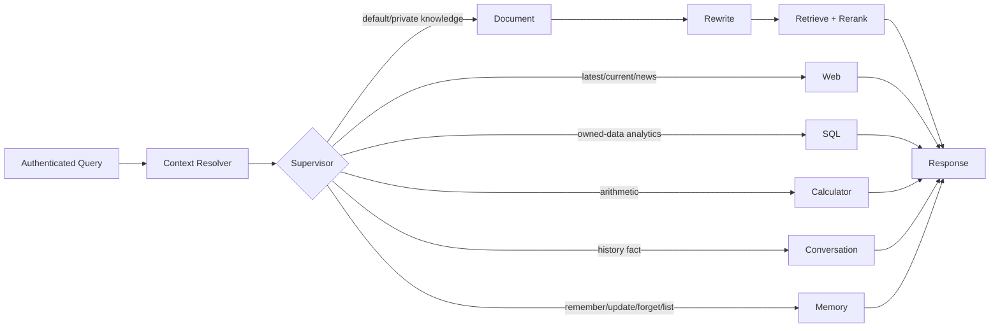
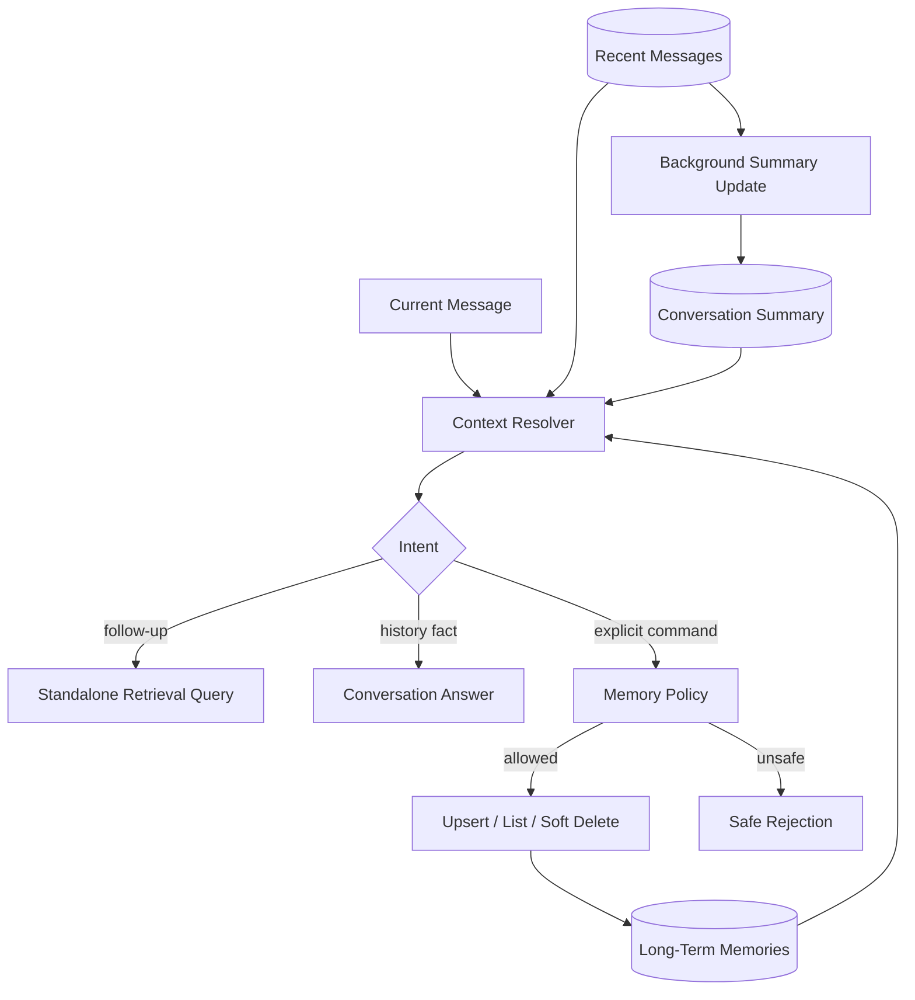
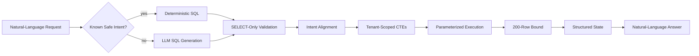
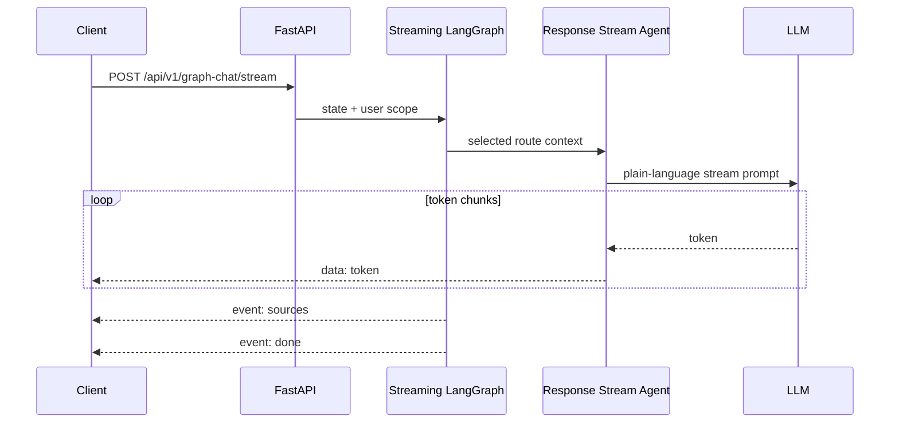
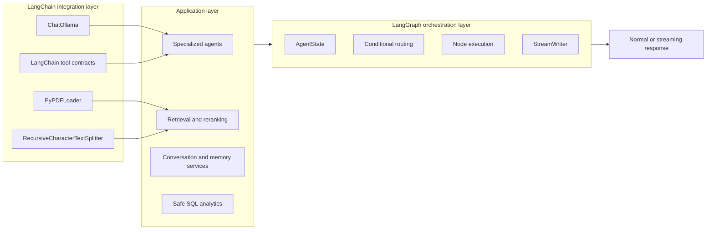
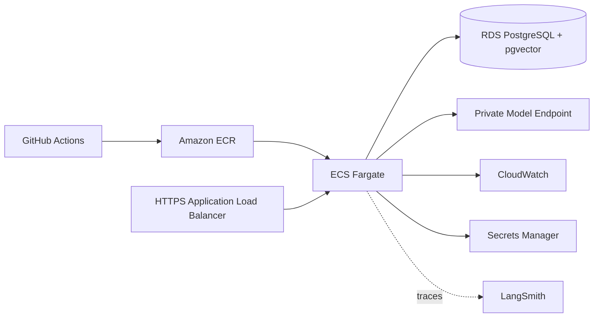
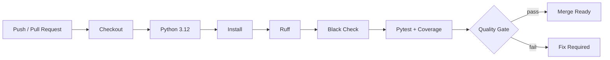

# Enterprise AI Assistant

<div align="center">

**A secure, observable multi-agent GenAI platform for grounded enterprise knowledge, analytics, and conversational intelligence.**

[](https://python.org)
[](https://fastapi.tiangolo.com)
[](https://postgresql.org)
[](https://github.com/pgvector/pgvector)
[](https://python.langchain.com/)
[](https://langchain-ai.github.io/langgraph/)
[](https://www.langchain.com/langsmith)
[](https://docker.com)
[](https://aws.amazon.com)
[](#system-architecture)

[Architecture](#system-architecture) · [API](#api-reference) · [Quick Start](#local-development) · [Evaluation](#evaluation-framework) · [Security](#security)

</div>

---

<p align="center">
  
</p>

<p align="center"><em>Secure request routing across RAG, web, SQL, calculation, memory, model, and observability services.</em></p>

---

## Executive Summary

Enterprise knowledge is fragmented across PDFs, operational databases, live web sources, and individual conversations. A basic chatbot can produce fluent text, but it cannot reliably select the correct source, enforce tenant boundaries, preserve useful context, expose evidence, or explain production failures.

Enterprise AI Assistant addresses that gap with a stateful LangGraph workflow behind a versioned FastAPI API. A supervisor routes each request to document retrieval, live web search, read-only SQL analytics, deterministic calculation, conversation context, or consent-based memory. Answers are grounded in evidence, streamed over Server-Sent Events when requested, traced through LangSmith, and tested with dataset-driven evaluations.

What makes it more than a chatbot:

- **Specialized agents** instead of one monolithic prompt.
- **Grounded answers** with PDF/page/snippet or web URL provenance.
- **Defense in depth** through JWT, tenant scoping, SQL validation, memory policy, rate limiting, and trace redaction.
- **Production visibility** through node spans, latency metrics, Prometheus, health checks, and reproducible evaluations.
- **Three-layer memory** using recent messages, incremental summaries, and explicitly managed cross-conversation facts.

## Key Features

| Capability | Implementation |
|---|---|
| Multi-agent architecture | Normal and streaming LangGraph state machines |
| LangChain integration | PDF loading, recursive text splitting, Ollama chat-model integration, and typed tools |
| Document intelligence | PDF extraction, numeric normalization, chunking, pgvector retrieval, cross-encoder reranking |
| Web search agent | Freshness-sensitive search with URL provenance |
| SQL analytics agent | Natural-language SQL, allowlisted relations, tenant CTEs, bounded SELECT-only execution |
| Calculator agent | Isolated deterministic arithmetic |
| Conversational rewriting | Ambiguous follow-ups become standalone retrieval queries |
| Short-term memory | Configurable recent-message window (default: 30) |
| Summary memory | Incremental background summaries with bounded inputs and advisory locking |
| Long-term memory | Typed remember, update, recall, list, and forget lifecycle |
| True streaming | Plain-text tokens followed by dedicated `sources` and `done` SSE events |
| LangSmith observability | Sanitized traces, node metadata, and route-level performance metrics |
| Evaluation framework | RAG, retrieval, citations, routing, SQL, memory isolation, and SSE tests |
| Secure tenant isolation | `user_id` enforced across documents, conversations, analytics, and memories |
| MCP integration | Authenticated knowledge, analytics, memory, and diagnostics tools |

## System Architecture

### High-Level Architecture



### Agent Routing Flow



### RAG Pipeline

```mermaid
flowchart LR
    Q[Query] --> R[Standalone Rewrite]
    R --> E[Ollama Embedding]
    E --> VS[pgvector + Lexical Ranking]
    VS --> F[Threshold + Deduplication]
    F --> RR[Cross-Encoder Reranking]
    RR --> CB[Bounded Context]
    CB --> LLM[Grounded Generation]
    LLM --> P[Structured Parsing]
    P --> SRC[Validated Sources]
```



### Memory Architecture



### SQL Agent Flow



### Streaming Flow



## LangChain and LangGraph

The project uses both technologies for different layers of the platform.
LangChain supplies focused integration components for documents, models, and
tools. LangGraph composes application agents into stateful normal and streaming
workflows. LangGraph does not replace LangChain here; it orchestrates the
LangChain-powered building blocks alongside application-owned services.



| Technology | Component | Actual responsibility | Code location |
|---|---|---|---|
| LangChain Community | `PyPDFLoader` | Load PDF pages with page metadata | `app/rag/loader.py` |
| LangChain Text Splitters | `RecursiveCharacterTextSplitter` | Create overlapping retrieval chunks | `app/rag/splitter.py` |
| LangChain Ollama | `ChatOllama` | Provide the shared chat-model adapter | `app/rag/generator.py` |
| LangChain Core | `@tool` | Define calculator and web-search tool contracts | `app/tools/` |
| LangGraph | `StateGraph` | Build normal and streaming workflow topology | `app/graph/workflow.py` |
| LangGraph | `StreamWriter` | Emit true response tokens from the streaming node | `app/agents/response_stream_agent.py` |

The application intentionally avoids opaque, monolithic chains. Retrieval,
reranking, SQL safety, memory policy, source construction, and metrics remain
explicit application code, making them independently testable and observable.

## Agentic Workflow

The graph resolves context first, routes once through the supervisor, executes one specialized branch, and converges on a shared response layer. The streaming graph has the same route topology and replaces only the terminal response node.

| Agent | Purpose | Inputs | Outputs | Example |
|---|---|---|---|---|
| **Context Resolver** | Resolves conversational references before routing | query, history, summary, memories | `resolved_query`, `context_route` | “What about emergency ones?” becomes standalone |
| **Supervisor** | Selects document, web, SQL, calculator, conversation, or memory | resolved query | `route` | “How many documents?” → `sql` |
| **Document Agent** | Starts private-document RAG | state query | document branch state | “What is the leave policy?” |
| **Rewrite Agent** | Rewrites only context-dependent document questions | query, bounded context | `retrieval_query`, `rewrite_ms` | “How many are allowed?” resolves the entity |
| **Retrieve Agent** | Embeds, searches, filters, deduplicates, and reranks user-owned chunks | retrieval query, user ID, DB | `documents`, metrics | returns strong PDF/page candidates |
| **Web Agent** | Retrieves current public information | query | `web_output`, provenance | “Latest AI news” |
| **SQL Agent** | Executes safe analytics over allowlisted tenant views | query, user ID, DB | `sql_output`, `sql_error` | “Group messages by role” |
| **Calculator Agent** | Performs deterministic arithmetic | query | `calculator_output` | “18% of 2,500” |
| **Conversation Agent** | Answers facts found in context or saved memories | query and memory context | `conversation_answer` | “What is my name?” |
| **Memory Agent** | Executes explicit typed memory commands | query and ownership data | `memory_output`, audit metadata | “Remember my timezone...” |
| **Response Agent** | Produces the stable answer/source contract | selected branch output | `answer`, `sources` | JSON response |
| **Response Stream Agent** | Streams natural-language tokens without exposing internal JSON | same branch output | tokens, sources, final answer | tokens → sources → done |

## Retrieval Pipeline

LangChain ecosystem components handle PDF loading (`PyPDFLoader`), recursive
chunking (`RecursiveCharacterTextSplitter`), Ollama chat-model integration
(`ChatOllama`), and tool declarations. LangGraph provides the stateful workflow,
conditional routing, node execution, and streaming orchestration around those
components.

1. **Context-aware rewrite** converts only ambiguous follow-ups into standalone questions.
2. **Embedding generation** uses `nomic-embed-text` and records embedding latency.
3. **Tenant-scoped retrieval** filters by `user_id` before ranking.
4. **Hybrid ordering** combines pgvector cosine distance, PostgreSQL lexical rank, and exact-label matching.
5. **Quality gates** remove unsupported low-score, empty, and duplicate chunks.
6. **Cross-encoder reranking** uses `cross-encoder/ms-marco-MiniLM-L-6-v2`; source identity is included for explicit PDF requests.
7. **Bounded context building** sends only the strongest evidence to the shared prompt builder.
8. **Grounded generation** uses structured internal output for normal chat and equivalent plain-text rules for streaming.
9. **Source projection** returns only selected file, page, and snippet metadata.

Tune behavior with `RETRIEVAL_TOP_K`, `RERANK_TOP_K`, and `RETRIEVAL_SCORE_THRESHOLD`.

## Memory System

### Short-Term Memory

The service loads recent messages for the current conversation, bounded by `CONVERSATION_HISTORY_LIMIT` (default: 30). History is used for context resolution and query rewriting—not indiscriminately appended to vector-search input.

### Conversation Summary Memory

After a configurable threshold, a background task incrementally summarizes older turns while preserving recent messages verbatim. Prompt sizes and batches are bounded; PostgreSQL advisory locks prevent concurrent writers for the same conversation.

### Long-Term Memory

Long-term memories are typed, user-scoped records in `user_memories`. They cross conversation boundaries but are written only through explicit user commands.

| Operation | Example | Behavior |
|---|---|---|
| Remember | `Remember that my timezone is Asia/Kolkata` | Upsert an allowlisted fact |
| Update | `Update my timezone to Europe/London` | Replace that user's key |
| Recall | `What is my timezone?` | Answer from saved context |
| List | `What do you remember about me?` | List active facts |
| Forget | `Forget my timezone` | Clear value and mark deleted |
| Forget all | `Forget everything about me` | Soft-delete all active facts |

Supported categories include profile, preference, and work-context fields such as name, preferred language, timezone, role, department, location, and favorite color. Credentials, tokens, private keys, payment/government identifiers, and prompt-injection instructions are rejected.

## SQL Analytics Agent

The agent exposes a narrow analytics schema instead of arbitrary application tables:

```text
tenant_conversations(id, title, created_at)
tenant_document_chunks(id, filename, page_number, chunk_index)
tenant_messages(id, conversation_id, role, content, created_at)
```

Safety controls:

- exactly one `SELECT` statement;
- allowlisted relations only—no base tables or PostgreSQL catalogs;
- user-scoped CTEs injected by trusted code;
- blocks mutations, DDL, `COPY`, `EXECUTE`, comments, multiple statements, `SELECT *`, and `UNION`;
- blocks unsafe PostgreSQL functions and validates count/grouping alignment;
- SQLAlchemy parameter binding, 200-row limit, and bounded cells;
- generated SQL remains internal; public responses contain natural language and `sources: []`.

```text
Question: Group my messages by role.
Internal state: [{"role":"assistant","message_count":405}, ...]
Public answer: Messages are grouped by role: Assistant: 405; User: 406.
```

## LangSmith Observability

Shared trace decorators capture route decisions, candidate counts, selected IDs, source counts, memory operations, stream events, and latency fields. Production defaults hide content and sanitize secrets, credentials, tokens, card-like values, URL query strings, and oversized values.

```text
graph_chat_request
└── LangGraph
    ├── context_resolver
    ├── supervisor
    ├── rewrite_agent
    ├── vector_retrieval
    ├── reranker
    ├── summary_memory_retrieval
    ├── sql_agent                 # SQL route only
    └── response_agent
```

| Metric | Scope |
|---|---|
| `context_resolution_ms` | conversational reference resolution |
| `rewrite_ms` | retrieval-query rewrite |
| `embedding_ms` | query embedding |
| `retrieval_ms` | candidate search/filtering |
| `rerank_ms` | cross-encoder ranking |
| `memory_retrieval_ms` | long-term memory lookup |
| `summary_retrieval_ms`, `summary_generation_ms` | summary operations |
| `sql_generation_ms`, `sql_execution_ms` | analytics route |
| `answer_llm_ms` | final generation |
| `total_request_ms` | full lifecycle |

Prometheus metrics are exposed at `/metrics` and scraped every 15 seconds in Compose. See the [LangSmith audit](evaluation/reports/langsmith_audit.md).

## Evaluation Framework

| Suite | Command | Measures |
|---|---|---|
| End-to-end RAG | `python -m evaluation.evaluate_rag` | answer and exact file/page citation accuracy |
| Retrieval audit | `python -m evaluation.audit_retrieval_quality` | Top-1/Top-3, false positives, reranker/rewrite impact, no-answer behavior |
| Capabilities | `python -m evaluation.evaluate_capabilities` | routing, SQL, memory isolation, SSE contract |
| Tests | `pytest` | API, workflow, security policy, prompt parity, numeric fidelity, tracing |

Datasets cover banking, ecommerce, healthcare, HR, logistics, manufacturing, and SaaS. Generated JSON reports live under `evaluation/reports/`. Values depend on the indexed corpus, models, and account, so no fabricated benchmark is presented here.

Example report contract (illustrative, not a measured claim):

```json
{
  "retrieval_success_rate": 0.94,
  "top_1_accuracy": 0.87,
  "top_3_accuracy": 0.94,
  "citation_file_and_page_accuracy": 0.91,
  "executed_cases": 100
}
```

Reproduce results using [`evaluation/README.md`](evaluation/README.md).

## Project Structure

```text
enterprise-ai-assistant/
├── app/
│   ├── agents/                 # Router, RAG, SQL, calculator, memory, response agents
│   ├── api/                    # Versioned HTTP endpoints and custom docs
│   ├── auth/                   # JWT, password, refresh-token lifecycle
│   ├── db/                     # SQLAlchemy session and models
│   ├── graph/                  # Normal and streaming LangGraph workflows
│   ├── mcp/                    # Authenticated MCP server, client, tools
│   ├── observability/          # LangSmith tracing and sanitization
│   ├── rag/                    # Loading, splitting, retrieval, reranking
│   ├── repositories/           # Persistence boundaries
│   ├── schemas/                # Public API contracts
│   ├── services/               # Application orchestration
│   ├── tools/                  # Calculator and web search
│   ├── utils/                  # SSE and pagination
│   ├── config.py               # Validated environment settings
│   └── main.py                 # FastAPI composition
├── alembic/                    # Database migrations
├── docker/                     # Dockerfile, Compose, environment template
├── evaluation/                 # Datasets, evaluators, reports
├── tests/{api,integration,unit}/
├── .github/workflows/ci.yml
├── prometheus.yml
├── pyproject.toml
├── requirements.txt
└── uv.lock
```

## API Reference

All application endpoints use `/api/v1`. Protected routes require `Authorization: Bearer <access_token>`. Swagger is available at `http://localhost:8000/docs`.

### Authentication

| Method | Endpoint | Purpose |
|---|---|---|
| `POST` | `/api/v1/register` | Create a validated account |
| `POST` | `/api/v1/login` | Issue access and refresh tokens |
| `POST` | `/api/v1/refresh` | Refresh access |
| `POST` | `/api/v1/logout` | Revoke refresh token |

```bash
curl -X POST http://localhost:8000/api/v1/register \
  -H "Content-Type: application/json" \
  -d '{"username":"tulesh.katre","email":"tulesh@example.com","password":"SecurePass2026!"}'
```

### Documents

| Method | Endpoint | Purpose |
|---|---|---|
| `POST` | `/api/v1/upload` | Validate and index a PDF |
| `GET` | `/api/v1/documents` | List owned documents |
| `DELETE` | `/api/v1/documents/{filename}` | Delete document and chunks |

```bash
curl -X POST http://localhost:8000/api/v1/upload \
  -H "Authorization: Bearer $TOKEN" \
  -F "file=@employee-handbook.pdf"
```

### Conversations and Chat

| Method | Endpoint | Purpose |
|---|---|---|
| `POST` | `/api/v1/conversation` | Create conversation |
| `GET` | `/api/v1/conversations` | List conversations |
| `GET` | `/api/v1/conversation_messages/{id}/messages` | List messages |
| `PATCH` | `/api/v1/conversation_rename/{id}` | Rename conversation |
| `DELETE` | `/api/v1/conversation_delete/{id}` | Delete conversation |
| `POST` | `/api/v1/chat` | Stateless document RAG |
| `POST` | `/api/v1/chat/stream` | Stateless RAG SSE |
| `POST` | `/api/v1/graph-chat` | Full multi-agent workflow |
| `POST` | `/api/v1/graph-chat/stream` | Full multi-agent SSE |

```bash
curl -X POST http://localhost:8000/api/v1/graph-chat \
  -H "Authorization: Bearer $TOKEN" \
  -H "Content-Type: application/json" \
  -d '{"conversation_id":1,"query":"What is the leave policy?"}'
```

```json
{
  "answer": "Employees receive 24 annual paid leave days.",
  "sources": [{
    "file": "uploads/employee-handbook.pdf",
    "page": 1,
    "snippet": "Employees receive 24 annual paid leave days..."
  }]
}
```

SSE contract:

```text
data: The
data:  policy

event: sources
data: [{"file":"uploads/employee-handbook.pdf","page":1,"snippet":"..."}]

event: done
data: completed
```

Memory operations intentionally use authenticated graph-chat natural language rather than a separate public CRUD API:

```json
{"conversation_id":1,"query":"Remember that my timezone is Asia/Kolkata"}
```

MCP also exposes `remember_user_fact` and `forget_user_fact` to authorized machine clients.

### System and MCP

| Method | Endpoint | Purpose |
|---|---|---|
| `GET` | `/api/v1/health` | Version and PostgreSQL health |
| `GET` | `/metrics` | Prometheus metrics when enabled |
| `POST` | `/mcp/` | Authenticated Streamable HTTP MCP transport |

MCP tools include `search_documents`, `ask_knowledge_base`, `run_safe_analytics`, `remember_user_fact`, `forget_user_fact`, and `system_diagnostics`.

## Local Development

Prerequisites: Python 3.12, PostgreSQL 16 with pgvector, Ollama, and Git.

```bash
git clone <your-repository-url>
cd enterprise-ai-assistant
python -m venv venv
```

```powershell
.\venv\Scripts\Activate.ps1
Copy-Item .env.example .env
pip install -r requirements.txt
pip install -e ".[dev,evaluation]"
```

Set real `DATABASE_URL` and `SECRET_KEY` values in `.env`; never commit it.

```bash
ollama pull qwen3:4b-instruct
ollama pull nomic-embed-text
ollama serve
alembic upgrade head
uvicorn app.main:app --reload
```

The cross-encoder reranker downloads on first use and is cached by Hugging Face.

```bash
ruff check .
ruff format --check app tests evaluation alembic
pytest
```

## Docker Deployment

Compose runs the API, PostgreSQL/pgvector, and Prometheus. Ollama remains on the host by default through `host.docker.internal`.

```powershell
Copy-Item docker/.env.example docker/.env
# Edit docker/.env with deployment-specific secrets.
docker compose --env-file docker/.env -f docker/docker-compose.yml up -d --build
docker compose --env-file docker/.env -f docker/docker-compose.yml ps
docker compose --env-file docker/.env -f docker/docker-compose.yml logs -f api
```

The image uses Python 3.12 slim, CPU-only PyTorch, a non-root user, and persistent upload/model caches. Migrations run before Uvicorn starts.

```powershell
docker compose --env-file docker/.env -f docker/docker-compose.yml down
```

Do not use `down -v` unless permanent database and monitoring-data deletion is intended.

## AWS Deployment Blueprint

The repository is container-ready. This is the recommended production topology—not a claim that AWS resources are already provisioned.

The step-by-step provisioning, CD, verification, rollback, and cost-control
procedure is maintained in the
[AWS ECS Fargate deployment runbook](docs/deployment/aws-ecs-fargate-runbook.md).



Recommended flow:

1. Test and scan an immutable image in CI; push its digest to ECR.
2. Keep JWT, DB, LangSmith, and MCP credentials in Secrets Manager.
3. Run Alembic as a one-off migration task.
4. Deploy ECS tasks in private subnets behind an HTTPS ALB.
5. Use encrypted RDS PostgreSQL with pgvector, backups, and restricted security groups.
6. Export structured logs/metrics to CloudWatch and sanitized traces to LangSmith.
7. Use health-checked rolling or blue/green rollout with automatic rollback.

## CI/CD

The committed GitHub Actions workflow runs on pushes and pull requests:



Production extensions: secret scanning, SAST, image/dependency scanning, signed ECR publishing, staged deployment, and rollback smoke tests.

## Security

| Control | Implementation |
|---|---|
| Authentication | Short-lived JWT and database-backed refresh tokens |
| Passwords | bcrypt hashing and validated registration inputs |
| Abuse controls | SlowAPI limits on auth, upload, and chat routes |
| Document isolation | Retrieval and document operations filter by authenticated `user_id` |
| Conversation isolation | Ownership checks before read/write/update/delete |
| SQL protection | Allowlisted tenant CTEs, SELECT-only validation, parameter binding |
| Memory privacy | Explicit consent commands, typed allowlist, sensitive-data rejection, forget flows |
| Trace privacy | Content off by default, redaction, payload bounds, URL sanitization |
| Production guardrails | Startup rejects weak secrets, default DB passwords, HTTP MCP URLs, content tracing |
| Containers | Non-root API process, slim runtime, private network, localhost binds by default |

These controls do not replace organization-specific threat modeling, penetration testing, key rotation, privacy review, or dependency scanning.

## Performance Metrics

| Stage | Metric | Primary tuning lever |
|---|---|---|
| Context | `context_resolution_ms` | deterministic bypass, bounded history |
| Embedding | `embedding_ms` | model host, batching, cache |
| Retrieval | `retrieval_ms` | pgvector index, candidate K, DB tuning |
| Reranking | `rerank_ms` | candidates and cross-encoder hardware |
| SQL | `sql_generation_ms`, `sql_execution_ms` | deterministic queries and indexes |
| Generation | `answer_llm_ms` | model, context, output limit |
| End-to-end | `total_request_ms` | route critical path |

Example operational targets—not measured claims:

| Signal | Example SLO | Alert condition |
|---|---:|---:|
| API availability | 99.9% monthly | burn-rate based |
| Non-streaming p95 | < 8 s | > 8 s for 10 min |
| First-token p95 | < 2.5 s | > 2.5 s for 10 min |
| Retrieval p95 | < 500 ms | > 500 ms for 10 min |
| 5xx rate | < 1% | > 2% for 5 min |

## Screenshots

The API-first repository works without images. For a portfolio presentation, capture only sanitized demo data:

| View | Evidence | Suggested path |
|---|---|---|
| LangSmith trace | hierarchy, route, latency, redaction | `docs/screenshots/langsmith-trace.png` |
| Chat client | token stream followed by citations | `docs/screenshots/chat-stream.png` |
| SQL analytics | natural-language result without raw SQL | `docs/screenshots/sql-analytics.png` |
| Memory lifecycle | remember, cross-chat recall, list, forget | `docs/screenshots/memory-lifecycle.png` |

## Roadmap

- Hybrid sparse/dense retrieval with learned fusion
- Async ingestion workers, document versions, and index lifecycle management
- More MCP integrations and enterprise connectors for storage, CRM, ticketing, and collaboration
- Adversarial RAG, calibrated LLM judges, regression gates, and online feedback
- RBAC/ABAC and organization-level tenant administration
- Redis caching, distributed rate limits, and idempotent jobs
- OpenTelemetry across API, DB, model serving, and LangSmith
- ECS/Kubernetes autoscaling and production Infrastructure as Code
- Human review for high-impact analytics and memory operations

## What This Project Demonstrates

- **GenAI engineering:** model integration, prompt contracts, structured and streaming generation.
- **RAG:** ingestion, hybrid vector/lexical retrieval, reranking, grounding, citations.
- **Agentic AI:** stateful orchestration, deterministic routing, specialized tools.
- **LangGraph:** normal/stream graph parity and common state contracts.
- **LangChain:** document loading, text splitting, model adapters, and reusable tool contracts.
- **Memory systems:** recent history, summaries, typed long-term recall, privacy lifecycle.
- **Safe SQL agents:** validation, tenant scoping, bounded read-only execution.
- **Backend engineering:** FastAPI, service/repository boundaries, PostgreSQL, Alembic, JWT.
- **Streaming:** true token SSE with independent source metadata.
- **Observability:** LangSmith, trace privacy, Prometheus, stage-level timing.
- **Evaluation:** domain datasets, retrieval/citation audits, isolation and capability tests.
- **Deployment:** reproducible dependencies, hardened Docker, Compose, AWS architecture.

## License

No open-source license is currently declared. Unless one is added, default copyright applies. Review licensing requirements before redistribution or commercial use.

---

<div align="center">

Built by **Tulesh Katre** as a production-oriented demonstration of enterprise RAG, agent orchestration, safe analytics, memory, streaming, observability, and evaluation.

</div>
